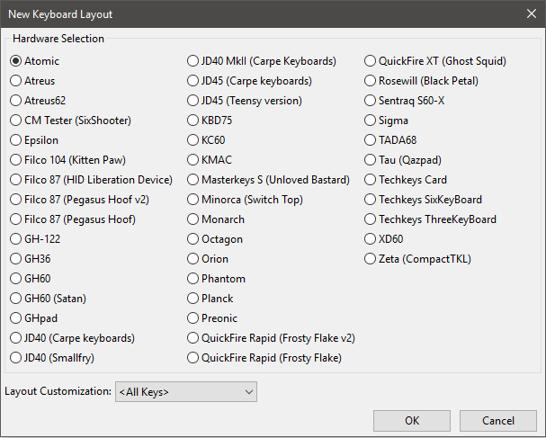
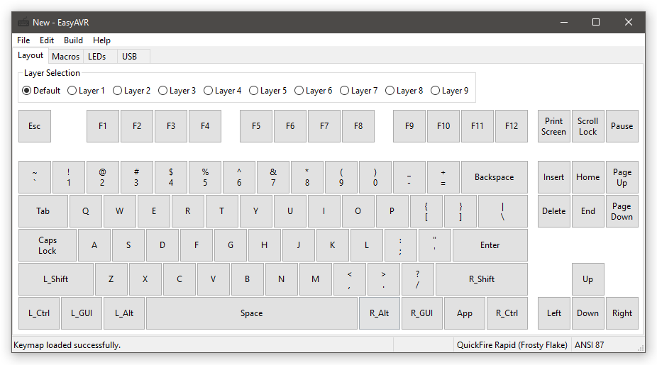
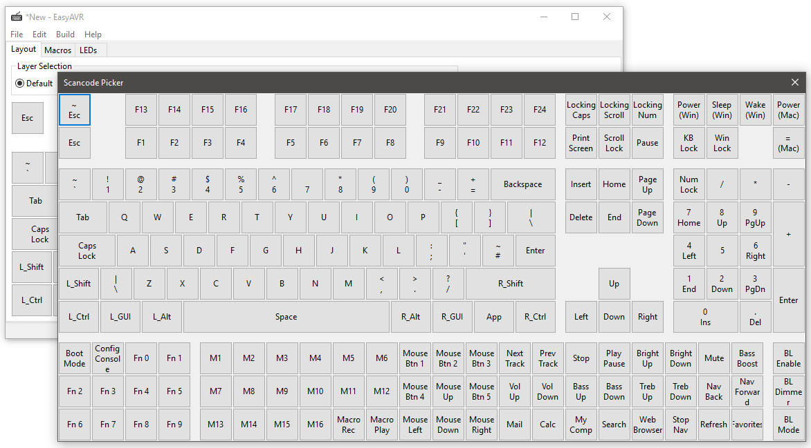

Getting Started
===============

Creating a Custom Keymap
------------------------



From the main window, select "File->New...".  In the "New Layout" dialog, 
select your keyboard type, then select your layout at the bottom.  Not all 
keyboards have multiple layouts.  The default is <All Keys>, which means 
every key the hardware supports is shown.  Layout mods are discussed in 
:doc:`cfgfiles`. Press OK to confirm your selection and create a new keymap.



You are presented with a view of the keyboard with a default map already 
assigned to the keys on the first layer (AKA the "default" layer).  In 
addition to the "Layout" view, there are also tabs for "Macros", "LEDs", and 
"USB".  They are discussed in the :doc:`macros`, :doc:`leds`, and :doc:`usb` 
chapters, respectively.

Your keymap can use up to 10 different layers.  Layers are discussed in the 
:doc:`functions` chapter.  To open a layer for editing, select it using the 
radio buttons near the top.  Most layers are initially empty.  You can easily 
populate a layer by copy/pasting from a different layer using the "Edit" menu.

.. image:: easykeymap_ss2.png

To customize your keymap, you need to assign scancodes to keys.  Edit a key 
assignment by clicking it, which will bring up the editor box.  This gives 
you some information about the key, and allows you to change the scancode 
assignment.  To reassign the selected key to a normal scancode, you can 
simply press the desired key on your physical keyboard (except for arrow 
keys, space, and escape, which are used to navigate the editor box).  To 
access the full range of available scancodes, you can select the "Scancode" 
parameter and click the "..." button, which will bring up the scancode picker 
tool.



The editor box also allows you to change the mode and automods of a key.  
These features, as well as all the special function scancodes, are discussed 
in the the :doc:`functions` chapter.

You're going to want to make sure you assign SCANCODE_BOOT somewhere on one 
of your layers.  It makes reprogramming easier.  I like to use Fn1+Esc.

When you're done with your layout, save it with "File->Save As...".

Programming a Build
-------------------

From the main window, select "Build->Build and Reprogram...".  This will 
create a .hex file that can be loaded onto your custom keyboard and then 
execute a programming tool to perform the load.  The "AVR Programming" dialog 
will open.

There are several programming tasks that may be selected.  These support 
various AVR and OS combinations.  The task you want is probably the one that 
has been auto-selected for you.

.. image:: easykeymap_ss6.png

Put your keyboard into boot mode.  Either press the key sequence that was 
previously programmed for boot, or use a hardware reset.  Teensy controllers 
have a button.  Most bpiphany controllers have a magnetic switch.  KMAC uses 
the Caps Lock key while plugging it in.  Other PCBs have a jumper.  Know your 
hardware.

Press "Run".  The programming process should only take a few seconds.  When 
it is done, the keyboard should automatically reconnect and start working.

Manually Programming
--------------------

It is not necessary to use the built-in programming dialog if you don't want 
to.  You may build a .hex file and program yourself it using an external tool.

Teensy
``````

Follow the instructions at the `Teensy website`_

.. _Teensy website: https://www.pjrc.com/teensy/loader.html

Flip
````

1. Open the Atmel Flip app
2. Click the microchip "Select a Target Device" icon and choose the AVR used by your board (usually ATmega32U4 or ATmega32U2)
3. Put your keyboard into bootloader mode
4. Click the USB "Select a Communications Medium" icon and choose "USB" from the menu
5. Click the red "Load HEX File" icon and open the .hex file you created in the keymapper
6. With the AVR now connected, click the "Run" button to reprogram with the new firmware
7. With a successful completion, click the "Start Application" button

dfu-programmer
``````````````

1. Put your keyboard into bootloader mode
2. Program your .hex file (replace device type as necessary)::

    sudo dfu-programmer atmega32u4 erase
    sleep 10
    sudo dfu-programmer atmega32u4 flash /path/to/firmware.hex
    sudo dfu-programmer atmega32u4 launch

AVR-dude
````````

AVR-dude may also be used on Linux, as explained here_.

.. _here: https://geekhack.org/index.php?topic=51252.msg2066099#msg2066099
