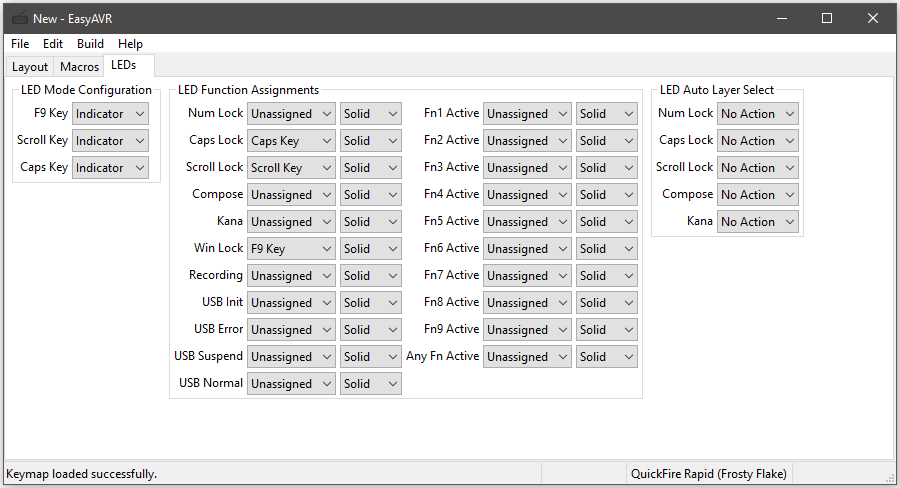

LED Functions
=============

There are two kinds of LEDs to configure in EasyAVR.  The first is LED 
indicators.  These are LEDs that mean something, such as Caps Lock and Num 
Lock.    The second kind is LED backlights.  These are purely for 
decoration.  Not all keyboards have backlights, but nearly all have 
indicators.  On keyboards that support backlighting, indicators can be 
programmed to act like backlights, but not the other way around.

LED indicators can be assigned to LED functions.  The first five functions 
are part of the USB keyboard spec and are turned on and off by the host PC.  
The rest are controlled by the state of the keyboard itself.  EasyAVR allows 
you to overload each LED with multiple functions by using blip codes.  These 
are explained below.

LEDs are configured using the "LEDs" tab.  In that tab, there are three 
sections: LED Modes Configuration, LED Function Assignments, and LED Auto 
Layer Select.

LED Modes
---------

In this section of the "LEDs" tab, indicator LEDs are listed and each can be 
configured to act as an indicator, a backlight, or neither (disabled).  
Normally, you want to leave these all set to "Indicator".  If you want an 
indicator to blend in with the surrounding backlights, you can choose 
"Backlight" instead.

LED Functions
-------------

In this section of the "LEDs" tab, you can configure what should be done to 
signal each LED function (if anything).  Most users do not need to be 
notified of every possible function.  Perhaps only the first three are 
important to you, and the rest may be left as "Unassigned".

If, for example, you wanted to see a signal that the keyboard is recording a 
RAM macro, you could assign your "Caps" LED to the "Recording" function.  
However, you probably would already have the "Caps" LED assigned to the "Caps 
Lock" function, so for "Recording", you could configure it to use "2 Blips".  
Therefore, when recording a RAM macro, it would blink the "Caps" LED twice in 
rapid succession, and that can be easily distinguished from "Caps Lock", 
which would simply turn the LED on (Solid).

In this way, a single LED may be used to indicate several possible states.  
Blink modes override eachother, so overloading an LED should only be done 
with mutually exclusive functions.

Here is an explanation of all LED functions:

'Num Lock', 'Caps Lock', 'Scroll Lock', 'Compose', 'Kana'
    These are the standard USB HID host status indicators.  The last two are
    only used on non-US keyboards.

'Win Lock'
    Lights up when the Windows Key is disabled.

'KB Lock'
    Lights up when the keyboard is locked.

'Fn1 Active', 'Fn2 Active', ..., 'Fn9 Active'
    Lights up when the corresponding layer is selected.  Locked layers will
    continue to indicate that the layer is active after the Fn key is lifted.
    The default layer does not set any LED indicator.

'Any Fn Active'
    Similar to above but lights up when any non-default layer is selected.

'Recording'
    Lights up when the keyboard is recording keystrokes.

'USB Init', 'USB Error', 'USB Suspend', 'USB Normal'
    Indicates the status of the USB connection to the host.

LED Auto Layer Select
---------------------

In this section of the "LEDs" tab, you can configure your keyboard to change 
the default layer when the host PC sets Num Lock, Caps Lock, or Scroll Lock.  
Most users will not need this feature, so all settings can safely be set to 
"No Action".

For example, if you want your PC to automatically select Layer 2 when Num 
Lock is active, you would set "Num Lock" to "Layer 2".

This can be useful for keyboards that don't have a num pad.  You can 
configure Layer 2 to be exactly like Layer 0, except that the number row is 
replaced with the equivalent num pad keys, then simply turn on Num Lock to 
access them.

Backlight Modes
---------------

Keyboards with backlighting can select between one of four backlighting 
modes.  These modes are not configured in the keymapper utility, they are 
selectable at run time.  Pressing the BL_MODE key will cycle through the four 
options.  No backlight effects will be observed if the user did not enable 
any lighting zones with the BL_ENABLE key.

'Static'
    Backlights are turned on and steady, with a brightness determined by the
    user-controlled dimmer (BL_DIMMER key).

'Breathing'
    Backlight brightness will continuously wax and wane in a smooth motion.

'Reactive'
    Backlights will glow at max brightness when the user presses a key, then
    dim to a low brightness in a smooth motion.

'Erosion'
    Backlights will be dimmed slightly on every key press, but continuously
    grow brighter in a smooth motion.  Fast typists will be able to extinguish
    the light.
