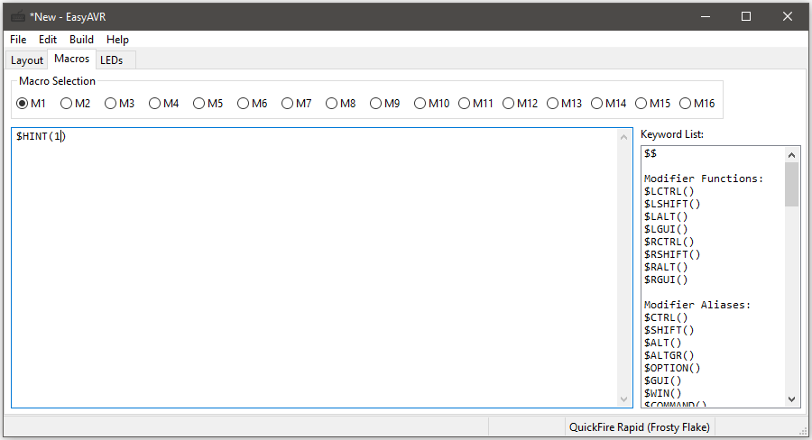

Writing Macros
==============

Current Macro limits:
    | 16 firmware macros
    | 2000 characters total
    | (macros can be any length, as long as all of them fit in the macro buffer)
    | unlimited mods per character
    | 1 RAM macro with 80 characters (40 on ATmega32U2 devices)

Overview
--------

Macro strings are specified as strings of characters that should be typed by 
the keyboard as if the keys were struck by hand.  So, if you wanted to bind a 
key to auto-type "Hello, World!", your macro string would simply be::

    Hello, World!

Note from the above example that it is not necessary to manually use Shift to 
get capital letters.  The system knows enough to replace "A" with "Shift+a" 
and "?" with "Shift+/". (See below for more on the use of modifier keys)

If you want your macro to include non-printable characters such as modifiers 
or navigation keys, you will need to use some special commands.  Special 
commands start with a dollar sign ($).  For example, to make your macro press 
the Home key, you would use::

    $HOME

To make it easier for the macro parser, it is recommended to put your special
commands in braces, like this::

    ${HOME}
    ${TAB}
    ${F5}

This syntax should be familiar to anyone who has worked with shell scripts.  
For a complete list of special commands, see the next section.

Since "$" is a reserved character, if you want to output an actual dollar 
sign, you can use this::

    $$

Mods are specified with a command followed by a string enclosed in
parenthesis.  The modifier key will be held for the entire sub-string.  For
example, you can get "HELLO WORLD!" by doing this::

    $SHIFT(hello, world!)

Note that since modifiers always end with a parenthesis, the braces aren't 
really necessary.  Another example::

    $CTRL($ALT($DEL))

If the substring is empty, the modifier will be pressed by itself::

    $GUI()

Note that this scheme means you can't use a mod on ")" because it would be
interpreted as the end of the sub-string.  But, why would you want to do that?
Just use a zero, "0".  The ")" and the "0" are the same key!

There are often multiple ways to get the same result.  For example, to get 
capital letters, you can just use capital letters in your macro string, or 
you can use "$SHIFT", but you could also do this::

    ${CAPSLK}hello, world!${CAPSLK}

Newlines in your macro string are translated to the Enter key.  The following 
two macro strings are equivalent::

    First line.
    Second line.
    
    First line.${ENTER}Second line.

Unicode characters can be inserted using a macro of an Alt Code.  For example::

    $ALT(130)
    $ALT(0161)
    $ALT(+11b)

Media keys can be part of macros.  To bind a key to open a browser and 
navigate to a website, you could do this::

    ${BROWSER}$WAIT(200)$CTRL(l)$WAIT(100)www.geekhack.org${ENTER}

To open a new tab instead of a browser, you could do this::

    $CTRL(t)$WAIT(100)www.geekhack.org${ENTER}

There are two special function macros.  Like modifiers, they are followed by 
parentheses, but instead of holding a substring, they hold arguments to the 
function.

The first special function macro is "$WAIT", which can pause the macro 
processing temporarily.  This is useful to slow the rapid keystroke rate when 
certain keystroke combinations require the computer to complete some 
processing before further input can be accepted.  It takes a decimal number 
as an argument which controls the length of the pause in macro processing.  
The value is stored as a byte so it must be between 0 and 255::

    $WAIT(250)

The value represents the number of macro cycles to wait. On boards with a 
500Hz macro frequency, a value of 250 should pause for about a half second.  
Some supported boards have a 250Hz macro frequency, so 250 would pause for 
about one second.  Longer pauses will require several wait commands.

The second special function macro is "$HINT".  This will translate into a 
large string that displays the currently programmed keymap for a selected 
layer, with zero (0) meaning the default layer and 1-9 referring to the Fn 
layers::

    $HINT(1)

Specials List
-------------

| Modifier Functions:
| $LCTRL()
| $LSHIFT()
| $LALT()
| $LGUI()
| $RCTRL()
| $RSHIFT()
| $RALT()
| $RGUI()
| 
| Modifier Aliases:
| $CTRL() ...alias for $LCTRL()
| $SHIFT() ...alias for $LSHIFT()
| $ALT() ...alias for $LALT()
| $ALTGR() ...alias for $RALT()
| $OPTION() ...alias for $LALT()
| $GUI() ...alias for $LGUI()
| $WIN() ...alias for $LGUI()
| $COMMAND() ...alias for $LGUI()
| $META() ...alias for $LGUI()
| 
| Special Functions:
| $WAIT()
| $HINT()
| 
| Non-printable keys:
| ${ESC}
| ${F1} through ${F24}
| ${PRINT}
| ${PAUSE}
| ${SCRLK}
| ${NUMLK}
| ${CAPSLK}
| ${INS}
| ${DEL}
| ${HOME}
| ${END}
| ${PGUP}
| ${PGDN}
| ${TAB}
| ${BKSP}
| ${ENTER}
| ${UP}
| ${DOWN}
| ${LEFT}
| ${RIGHT}
| ${SPACE}
| ${APP}
| ${NON_US_BACKSLASH}
| 
| Keypad keys:
| ${KPSLA}
| ${KPAST}
| ${KPMIN}
| ${KPPLS}
| ${KPENT}
| ${KP1}
| ${KP2}
| ${KP3}
| ${KP4}
| ${KP5}
| ${KP6}
| ${KP7}
| ${KP8}
| ${KP9}
| ${KP0}
| ${KPDOT}
| ${KPEQ}
| 
| Media keys:
| ${MUTE}
| ${VOLUP}
| ${VOLDN}
| ${BASS}
| ${NEXT}
| ${PREV}
| ${STOP}
| ${PLAY}
| ${MAIL}
| ${CALC}
| ${MYCOMP}
| ${SEARCH}
| ${BROWSER}
| ${BACK}
| ${FORWARD}
| ${WWWSTOP}
| ${REFRESH}
| ${FAVES}
